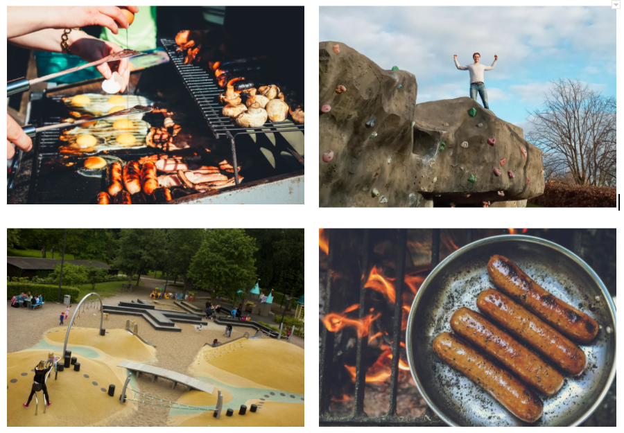
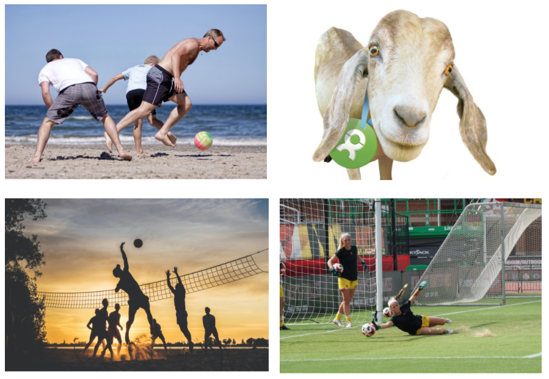
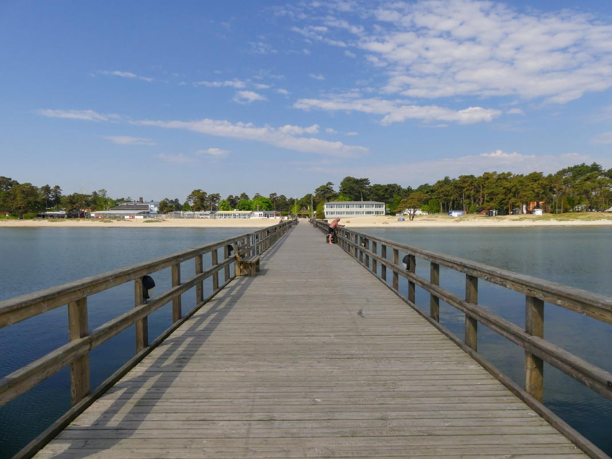
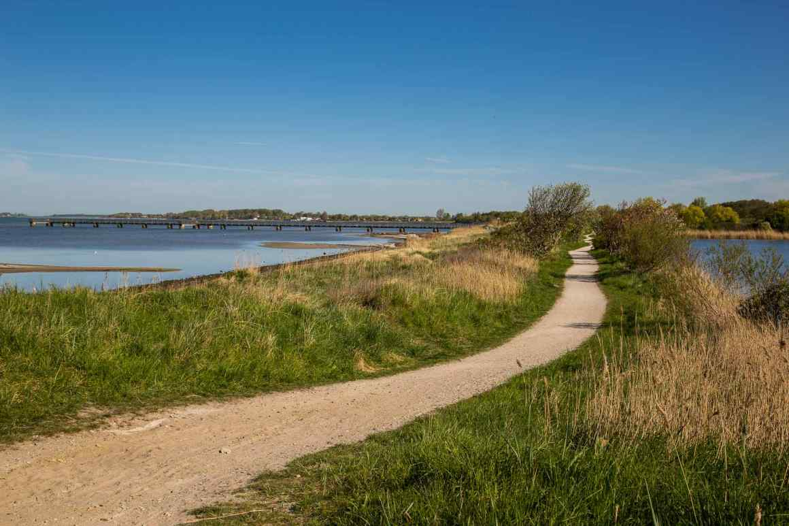
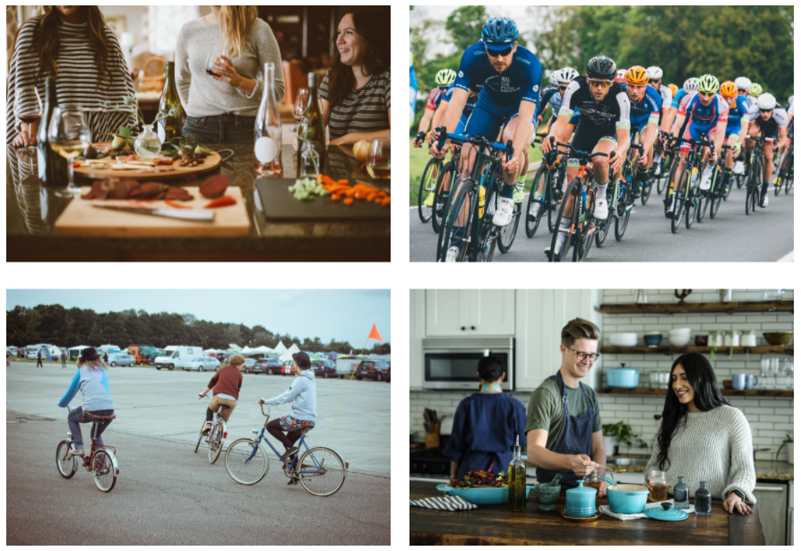

```{r setup, include=FALSE}
knitr::opts_chunk$set(echo = F)

library(flexdashboard)
library(tidyverse)
library(shiny)
library(plotly)
library(glue)
library(DT)
library(janitor)
library(leaflet)
library(knitr)

theme_set(theme_light())
```


```{r}


```

Welcome
==================================================================================

.column
------------------------------------------

<center>

**Welcome to our proposal for the INTC International Exchange Week.** 

This week is all about celebrating different nationalities and making sure the the international visitors to Lund feel welcome. It is a little bit different than usual because of Corona times, but we are sure that it will still be a blast!

If you click on the **Programme** tab you will see what we have planned for each day. By adjusting the inputs, you will see the total cost of the week change in the sidebar. We hope that this is useful!

We note that cost will depend on the number of sign-ups, which we envisage as being 20 for the opening function.

We will seperate the events such that every activity will happen in a group of 8 - for example, at the beachfootball and volleyball event we will split those who sign up into groups of 8 who will play together and mix teams within those groups of 8.


</center>


Programme{.storyboard}
==================================================================================

Cost Breakdown:{.sidebar}
------------------------------------------

#### Cost Breakdown

```{r}

renderPlotly({

  p <- tibble(
    names = c("Wednesday", "Thursday", "Friday", "Saturday", "Sunday"),
    values = c(sum(70, input$bbq*input$hot_dog), 
               400*if_else(input$goat == TRUE, 1, 0), 
               8*input$absolut, 
               0, 
               input$bike),
    order = c(5, 4, 3, 2, 1)) %>%
    mutate(names = fct_reorder(names, order)) %>% 
    ggplot(aes(values, names, fill = names, text = glue("{names}, {values}kr"))) +
    geom_col(show.legend = F) +
    labs(y = NULL,
         x = NULL) +
    scale_fill_brewer(palette = "Dark2") +
    theme(legend.position = "none",
          panel.grid = element_blank())
  
  ggplotly(p, tooltip = "text") 

})

renderDT(

  tibble(
    names = c("Wednesday", "Thursday", "Friday", "Saturday", "Sunday"),
    values = c(sum(70, input$bbq*input$hot_dog), 
               400*if_else(input$goat == TRUE, 1, 0), 
               8*input$absolut, 
               0, 
               input$bike)) %>% 
    adorn_totals(),
  colnames = c("Day of Week", "Cost"),
  rownames = FALSE

)


```


------------------------------------------
### WEDNESDAY: Outdoor get-together BBQ{data-commentary-width=500}



***

The plan for Wednesday is an outdoor get-together. We want to do some barbecuing at Delphi.

**Covid-19 Mitigation Strategy:**

- This event is outdoors in the open air, and as such will mitigate contact between individuals in enclosed spaces which are high risk for Covid-19 transmission.
- We will make hand sanitizer available at the event.
- We will have a briefing at the beginning of the event explaining the risks arising from Covid-19, the mitigation strategies we are using, and what they should do if they begin to feel ill. 
- If anyone begins to feel ill we will encourage them to go home, and we will ask everyone in attendance to self-isolate until the unwell individual has been tested. 
- We will not share food, plates or utensils between individuals.
- We will not serve alcohol at the event. This will lower the possibility of people behaving in a way that will result in Covid-19 transmission.

**Time of responsibility**

- The event will take place between 18:00 and 21:00. At 21:00 we will declare the event over, and we will no longer be responsible for the activities of attendees. 

**Select Inputs:**
```{r}
sliderInput("bbq", label = "Number of Signups:",
            min = 5, max = 50, value = 20, step = 1)

sliderInput("hot_dog", label = "Cost of food per person:",
            min = 5, max = 50, value = 20, step = 1)

renderDT(
  
  tibble(
    
    names = c("Coal and BBQ Supplies", "BBQ Food"),
    
    values = c(70, input$bbq*input$hot_dog)
    
  ) %>% 
    adorn_totals(),
  colnames = c("Items", "Cost"),
  rownames = FALSE
  
)


```

### THURSDAY: Beachfootball at Delphi{data-commentary-width=500}



***

The plan for Friday is to have a beachfootball and volleyball tournament at Delphi We plan to get people to come together and play in teams. It will be such fun!


**Covid-19 Mitigation Strategy:**
- This event is outdoors in the open air, and as such will mitigate contact between individuals in enclosed spaces which are high risk for Covid-19 transmission.
- We will make hand sanitizer available at the event.
- We will have a briefing at the beginning of the event explaining the risks arising from Covid-19, the mitigation strategies we are using, and what they should do if they begin to feel ill.
- If anyone begins to feel ill we will encourage them to go home, and we will ask everyone in attendance to self-isolate until the unwell individual has been tested. 
- We will not share food, plates or utensils between individuals.

**Time of responsibility**


The prize is very exciting! The best player, who everyone will vote for, is the GOAT. Their prize is to name a goat which we will donate to a village in Africa through [Oxfam Gifts](https://www.oxfamgifts.com/gifts/donate-goat/). 

In their words, *"A hardy goat is the gift of sustainability, which means fertilizer and food for families—especially those living in areas that cannot support less-durable critters"*. Have a look at the link if you want to know more.

Jonathan is happy to buy the goat if it will not fit in the budget. He likes the goat.

```{r}

checkboxInput("goat",
              "LE Pays for Goat",
              value = T)

renderDataTable(
  
  tibble(
    names = c("GOAT goat"),
    values = c(400*if_else(input$goat == TRUE, 1, 0))     
         ) %>% 
    adorn_totals(),
  colnames = c("Items", "Cost"),
  rownames = FALSE
  
)

```


### FRIDAY: Daytrip to Österlen/Åhus + Absolut Vodka Guided Tour at the factory{data-commentary-width=500}



***
Filip has organized an exciting trip so that international students will get to experience the beauty of Skåne County. It includes a walk on the beach and pier at Österlen, sightseeing in Åhus and a guided tour at the [Absolut Vodka](https://www.absoluthome.com/?gclid=Cj0KCQjwyN-DBhCDARIsAFOELTk2kmM2iZZqppNgxmBNgbvzUe7ZQIRwWfiI1HGG7zmNJuBWrAVXCmUaAhRSEALw_wcB) factory in Åhus. Students who sign up will experience the incomparable story of Absolut Vodka, one of the world's most iconic liquor brands!

We envisage that we will rent two vehicles to take everyone up the coast. This will be a fun day out for all involved!s

We want to motivate for a contribution by LE to lower the cost for students involved, given that it is quite pricey. The cost of the day out, including the tour and renting of two cars is 449kr/person with alcohol, and 369kr without.

**Covid-19 Mitigation Strategy:**

- This event involves transport of individuals in cars and as such we will wear masks while we are in the confined space of the vehicle. We have a box of surgical masks that we will use for this purpose.
- We will encourage attendees to take a Covid-19 test two days before they come on the trip. 
- In addition, we will make sure that everyone is feeling healthy before we leave on the day.
- We will have a briefing at the beginning of the event explaining the risks arising from Covid-19, the mitigation strategies we are using, and what they should do if they begin to feel ill. 
- If anyone begins to feel ill we will encourage them to go home, and we will ask everyone in attendance to self-isolate until the unwell individual has been tested. 
- We will not share food, plates or utensils between individuals.

**Time of responsibility**

- The event will take place between 10:00 and 16:00. At 16:00 we will declare the event over, and we will no longer be responsible for the activities of attendees. 


```{r}

sliderInput("absolut", label = "Subsidy provided by LE for day out (SEK)/person:",
            min = 0, max = 300, value = 100, step = 10)

renderDataTable(
  
  tibble(
    names = c("LE Contribution"),
    values = c(8*input$absolut)) %>% 
    adorn_totals(),
  colnames = c("Item", "Cost"),
  rownames = FALSE
  
)

```


### SATURDAY: Daytrip to Lomma beach{data-commentary-width=500}




***
The plan for Saturday is to take a nice evening cycle to Lomma beach to watch the sun go down. It will be such a delight if the weather is good to enjoy the sunset and chat.

We bike together and people can bring their own snacks and such. This will incur no cost for the committee.

**Covid-19 Mitigation Strategy:**

- This event involves cycling to Lomma. We will have groups of 8 individuals cycling together to mitigate the transmission of Covid-19. 
- The groups will set off from different meeting points in Lund. 
- Upon arrival at Lomma, the groups will picnic in different places along the beach in the open air.
- We will have a briefing at the beginning of the event explaining the risks arising from Covid-19, the mitigation strategies we are using, and what they should do if they begin to feel ill. 
- If anyone begins to feel ill we will encourage them to go home, and we will ask everyone in attendance to self-isolate until the unwell individual has been tested. 
- We will not share food, plates or utensils between individuals.

**Time of responsibility**

The event will be between 17:00 and 20:00. At 20:00 we will declare the event over and will no longer be responsible for the actions of the attendees. 


```{r}

hike <- tibble(
  
  lng = c(13.194710, 13.059278),
  
  lat = c(55.702888, 55.677439),
  
  popup = c("Lund", "Lomma")
  
)

# lund_lomma <- read_csv("international-exchange-week/data/lund_lomma_2.csv")

lund_lomma <- read_csv("data/lund_lomma_2.csv")


hike_route <- lund_lomma %>% 
  as_tibble() %>% 
  select(lng = X, lat = Y) %>% 
  mutate(popup = "route")

m <- leaflet() %>%
  addTiles() %>%  # Add default OpenStreetMap map tiles
  addMarkers(
    lng = hike$lng,
    lat = hike$lat,
    popup = hike$popup
             ) %>% 
  addPolylines(lat = hike_route$lat, 
               lng = hike_route$lng) %>% 
  addProviderTiles(providers$CartoDB.Positron)
m  # Print the map

```


### SUNDAY: Bike-party: international theme {data-commentary-width=500}



***
You know what it is! A bike party! A Lund classic event, sure to be enjoyed!

We plan to arrange the event, divide up the signups into teams of 3, and get each team to prepare a dish that reflects their culture.


It would be really nice to provide some food budget. If there is more money available for this purpose, it would be wonderful! Slide that slider up!

```{r}
sliderInput("bike", label = "Food Budget for Bike Party:",
            min = 0, max = 2000, value = 500, step = 50)

renderDataTable(
  
  tibble(
    names = c("Bike Party Food Cost"),
    values = c(input$bike)) %>% 
    adorn_totals(),
  colnames = c("Item", "Cost"),
  rownames = FALSE
  
)

```


